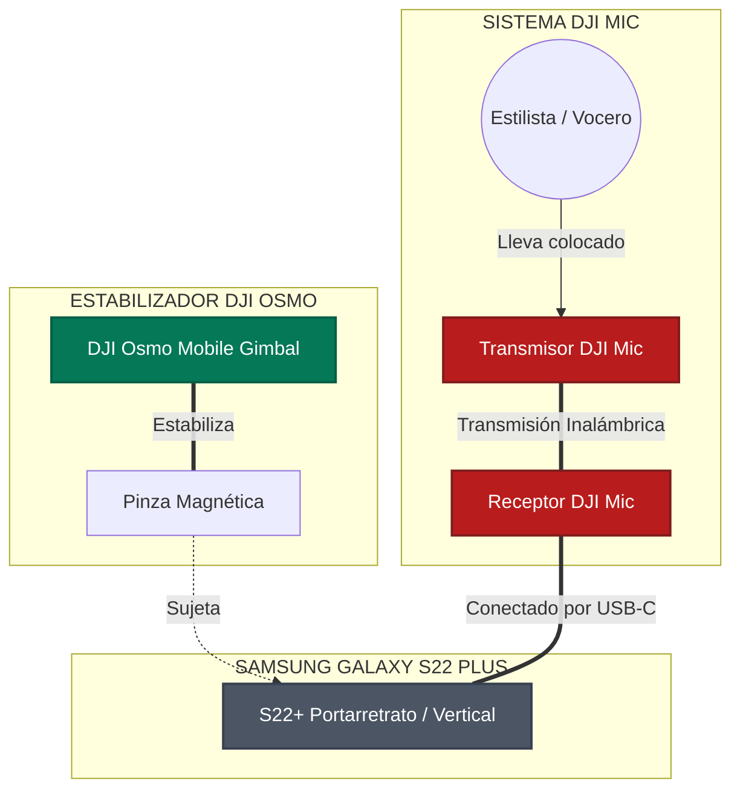

# 📘 MANUAL DE PRODUCCIÓN MÓVIL PREMIUM
## *Grabación Profesional de Truss en Dos Soles*

---

> [!IMPORTANT]
> **FORMATO DE LECTURA Y EXPORTACIÓN:** 
> Este documento ha sido estructurado con formato de alta fidelidad editorial. Si lo deseas, puedes imprimirlo directamente desde tu editor o exportarlo a PDF (usando la función "Exportar a PDF" de VS Code o tu navegador) para llevarlo impreso en papel o guardarlo en tu teléfono como manual de consulta rápida durante el evento.

---

## 🗺️ ÍNDICE DE CONTENIDOS
1. **Esquema de Conectividad y Flujo de Trabajo**
2. **Paso a Paso Visual: Configuración de Dispositivos**
3. **Guía Visual de Transiciones Físicas**
4. **La Biblioteca de Planos (Shot List Completa)**
5. **Cronograma de Trabajo para el Lunes (Minuto a Minuto)**
6. **Flujo de Edición Rápida y Profesional (CapCut)**
7. **Checklist Final de Supervivencia**

---

## 🔌 1. Esquema de Conectividad y Flujo de Trabajo

Para que entiendas cómo interactúan tus tres equipos principales, este es el mapa físico de cómo debe ir montado tu kit de grabación:



---

## ⚙️ 2. Paso a Paso Visual: Configuración de Dispositivos

Realiza estas configuraciones en orden estricto antes de salir de casa.

### 📱 PASO A PASO 1: Samsung Galaxy S22+
Configuraremos el teléfono para capturar la máxima calidad de color y movimiento compatible con redes.

```
Paso 1: Entrar a Cámara ➡️ Tocar ícono de Engranaje (Ajustes)
Paso 2: Buscar "Cuadrícula" ➡️ ACTIVAR (Muestra líneas guía de tercios)
Paso 3: Buscar "Estabilización de video" ➡️ DESACTIVAR (Para evitar conflictos con el Gimbal)
Paso 4: Volver a la pantalla de cámara ➡️ Cambiar formato a 9:16 (Vertical)
Paso 5: Seleccionar modo "Video" ➡️ Tocar arriba a la derecha ➡️ Ajustar a "FHD 60"
```

* **¿Por qué FHD 60?** Los 60 FPS (cuadros por segundo) hacen que el movimiento del cabello sea hiper fluido. Además, te permitirá ralentizar el video en edición a la mitad (cámara lenta al 50%) para lograr tomas cinematográficas espectaculares.

---

### 🕹️ PASO A PASO 2: DJI Osmo Mobile (Gimbal)
El balanceo físico correcto es el secreto para que los videos no salgan temblorosos y los motores del gimbal no se sobrecalienten.

```
[ PASO 1: PINZA MAGNÉTICA ]
Coloca la pinza magnética en el centro exacto del S22+. 
⚠️ La flecha blanca grabada en la pinza debe apuntar hacia la cámara del teléfono.

[ PASO 2: ACOPLE ]
Acopla la pinza magnética al imán del brazo del Gimbal.
⚠️ Asegúrate de que las marcas de alineación coincidan. No lo enciendas aún.

[ PASO 3: ENCENDIDO Y DESPLIEGUE ]
Despliega el brazo del gimbal. Se encenderá automáticamente.
El teléfono se nivelará de inmediato.

[ PASO 4: SELECCIÓN DE MODO ]
Presiona el botón "M" del gimbal para alternar entre modos:
➡️ FPV (Luz FPV en pantalla): El teléfono sigue todos tus movimientos de muñeca. Úsalo para transiciones dinámicas.
➡️ FOLLOW (Luz F): El teléfono se mantiene nivelado con el horizonte. Úsalo para tomas normales de paseo.
```

---

### 🎙️ PASO A PASO 3: DJI Mic (Audio)
El audio representa el 50% del éxito de un video. El público tolera un video con grano, pero descarta de inmediato un video que se escucha mal.

```
[ PASO 1: CONEXIÓN ]
Saca el Receptor (pantalla táctil) de la caja de carga.
Desliza el adaptador USB-C en la base del receptor.
Conéctalo firmemente en el puerto de carga de tu S22+.

[ PASO 2: VERIFICACIÓN ]
Enciende el receptor. Saca un Transmisor (micrófono).
Verifica en la pantalla del receptor que se encienda la barra de nivel (barra vertical que sube y baja al hablar).
Si se mueve, la señal está enlazada perfectamente.

[ PASO 3: EL CORTAVIENTOS (DEADCAT) ]
Inserta el protector peludo cortavientos (deadcat) en la parte superior del transmisor, girándolo en sentido horario hasta que trabe.
⚠️ ESTO ES OBLIGATORIO: Evita que el aire del secador sature la cápsula.

[ PASO 4: COLOCACIÓN ]
Coloca el micrófono al estilista a la altura del esternón (pecho central).
Usa el clip o el imán que incluye el DJI Mic por debajo de la remera para que quede firme y estético.
```

---

## 🎬 3. Guía Visual de Transiciones Físicas

Las transiciones físicas mantienen el ritmo y retienen la atención en las historias de Instagram y Reels. Aquí tienes las 4 más efectivas, dibujadas y detalladas paso a paso con su modo DJI de referencia.

### 🔄 Transición 1: El Látigo Rápido (Whip Pan) `[FPV 🖾]`
Crea una sensación de velocidad y cambio instantáneo de escena.

```
🕹️ Modo del Estabilizador: [FPV 🖾]
ESCENA A: El peluquero aplicando el producto Truss
🎥 Cámara: Grabando de cerca ➡️ Paneo ultra rápido hacia la DERECHA ➡️ CORTAR GRABACIÓN
                                                  ⬇️
                                      [Corte en la edición]
                                                  ⬇️
ESCENA B: El lavado de cabeza de la modelo
🎥 Cámara: Iniciar grabación con Paneo ultra rápido de IZQUIERDA a DERECHA ➡️ Frenar justo frente a la modelo
```

---

### 🧴 Transición 2: Bloqueo de Lente con Producto (Lens Block) `[PTF ⌖]`
Una transición súper comercial e ideal para marcas de belleza.

```
🕹️ Modo del Estabilizador: [PTF ⌖]
ESCENA A: El peluquero sosteniendo la botella de Truss Uso Obligatorio
🎥 Cámara: Grabar al peluquero sosteniendo el envase.
👉 Acción: El peluquero empuja la botella rápidamente hacia la cámara hasta tapar la lente por completo (Pantalla a negro).
                                                  ⬇️
                                      [Corte en la edición]
                                                  ⬇️
ESCENA B: La modelo con el look finalizado
🎥 Cámara: Iniciar toma con la botella pegada a la lente (Pantalla a negro).
👉 Acción: Retirar la botella hacia atrás rápidamente para revelar el cabello brillante y sonriente de la modelo.
```

---

### 🪞 Transición 3: El Desenfoque de Lente (Bokeh / Focus Fade) `[PTF ⌖]`
Una transición suave, de estilo editorial de belleza, que aprovecha las luces del salón para fundir escenas de forma artística.

```
🕹️ Modo del Estabilizador: [PTF ⌖]
ESCENA A: El proceso de coloración o lavado finalizado
🎥 Cámara: Tocar la base de la pantalla del celu o acercarse mucho a un objeto para desenfocar por completo la modelo (Pantalla desenfocada).
                                                  ⬇️
                                      [Corte en la edición]
                                                  ⬇️
ESCENA B: La modelo peinada con Brillo Espejo
🎥 Cámara: Iniciar toma desenfocada ➡️ Tocar la pantalla para que el autoenfoque del S22+ logre la nitidez total en un segundo sobre el cabello brillante.
```

---

### 🌀 Transición 4: El Giro de Vórtice (Spin / Roll Transition) `[FPV 🖾] / [SPINSHOT ⟳]`
Una transición enérgica y dinámica basada en la rotación física para conectar el laboratorio técnico y el salón.

```
🕹️ Modo del Estabilizador: [FPV 🖾] o [SPINSHOT ⟳]
ESCENA A: El peluquero batiendo la crema en el bowl o aplicando
🎥 Cámara: Grabar la acción de forma estable ➡️ Rotar rápidamente la cámara de tu celu girando tu muñeca 180° a la izquierda ➡️ CORTAR.
                                                  ⬇️
                                      [Corte en la edición]
                                                  ⬇️
ESCENA B: La modelo ya finalizada
🎥 Cámara: Iniciar grabación rotando el gimbal hacia la izquierda otros 180° ➡️ Estabilizar al instante frente al cabello brillante de la modelo.
```

---

## 📸 4. La Biblioteca de Planos (Shot List Completa)

Lleva este checklist contigo el lunes para asegurarte de no volver a casa con material faltante. Haz al menos 3 tomas de cada uno. Junto a cada toma encontrarás el modo del estabilizador DJI recomendado.

### 🏢 Categoría A: Contexto e Introducción (El Gancho)
* [ ] **Plano 1: La entrada dinámica** `[PTF ⌖]`: Camina con el gimbal hacia la entrada del centro técnico Dos Soles. Paso firme pero suave (caminata ninja).
* [ ] **Plano 2: El Peluquero Estrella** `[LOCK 🔒]`: Plano medio del estilista ordenando los productos sobre la mesada. Pídele que mire a la cámara, sonría y salude con la mano.
* [ ] **Plano 3: El Altar de Truss** `[PF ⌂]`: Toma general de la línea de productos Truss perfectamente ordenados bajo las luces del salón.

### 🧪 Categoría B: El Proceso Técnico (Detalles y Texturas)
* [ ] **Plano 4: El Unboxing del Producto** `[PF ⌂]`: Plano cerrado de las manos del peluquero abriendo la tapa o presionando el dosificador.
* [ ] **Plano 5: La Alquimia** `[PF ⌂]`: Plano macro (muy de cerca) de la mezcla de color o producto en el bowl. El batido con el pincel genera una textura cremosa espectacular en 60 FPS.
* [ ] **Plano 6: La Aplicación Detallada** `[PTF ⌖]`: Plano medio y cerrado de los dedos del peluquero separando mechones y aplicando el producto con pinceladas precisas.
* [ ] **Plano 7: La Reacción Química** `[PTF ⌖]`: Si el producto genera vapor, espuma o reposa bajo una lámpara térmica, graba un plano de ese proceso.

### 💦 Categoría C: Sensorial y Lavado
* [ ] **Plano 8: El Lavacabezas Cenital** `[PTF ⌖]`: Graba desde arriba cómo cae el agua sobre el cabello. La caída del agua y la espuma en cámara lenta tienen un efecto hipnótico en redes.
* [ ] **Plano 9: El Masaje Capilar** `[PTF ⌖]`: Plano cerrado de las manos del peluquero haciendo el masaje de lavado. Transmite relajación y cuidado premium.

### ✨ Categoría D: El Secado y la Revelación
* [ ] **Plano 10: El Soplo de Viento** `[PTF ⌖]`: Graba el cabello volando con el aire del secador. Colócate a contraluz para que cada cabello brille.
* [ ] **Plano 11: El Movimiento de la Peineta** `[PTF ⌖]`: El cepillo redondo deslizando por el mechón de cabello de arriba a abajo, revelando un lacio u ondas perfectas.
* [ ] **Plano 12: El Brillo Espejo** `[PTF ⌖]`: Pídele a la modelo que mueva suavemente la cabeza de lado a lado. Capta el reflejo de la luz sobre el cabello (Brillo Truss).
* [ ] **Plano 13: La Gran Sonrisa (El Éxito)** `[LOCK 🔒]`: Plano medio de la modelo mirándose al espejo, tocándose el cabello con una sonrisa de felicidad.

---

## 📅 5. Cronograma de Trabajo para el Lunes (Minuto a Minuto Técnico y de Publicación)

Sigue este itinerario paso a paso el lunes para coordinar las tomas con la publicación de historias en vivo en Dos Soles:

* **08:30 — Llegada e Inspección Visual (Scouting de Luces)**:
  * **Acción:** Recorre el Centro Técnico Dos Soles. Identifica los mejores ventanales con luz natural y reflectores. Busca dónde dejar tu batería externa (Power Bank) cargando como respaldo.
  * **Cámara:** Pasa el paño de microfibra por los lentes de tu S22+.
* **08:45 — Conexión y Pruebas de Audio Críticas (Con DJI Mic Mini)**:
  * **Acción:** Enchufa el receptor en tu Samsung (o haz el enlace por Bluetooth). Sujeta el micrófono de solapa al peluquero con el cortavientos de felpa (deadcat).
  * **Prueba:** Grábalo hablando 10 segundos, **ponte tus auriculares** y escúchalo. Debe sonar nítido y libre del zumbido del aire acondicionado.
  * **Configuración:** Activa el canal **Mono** (audio centrado), la **Pista de Seguridad** a -6dB (para evitar roturas si grita o ríe) y el **Corte Bajo (Low Cut)** para filtrar ruidos graves.
* **09:00 — Historia 1: El Gancho (Publicar la Llegada)**:
  * **Acción:** Graba la Toma 1 (La Entrada Dinámica). 
  * **Estabilizador:** `[PTF ⌖]`. Entra con paso ninja (rodillas flexionadas, deslizando talones) cruzando la puerta de Dos Soles en un plano continuo de 5 segundos.
  * **Publicación:** Sube este video a tus historias con la música en tendencia de fondo.
  * **Texto en pantalla:** *"¡Buen día! Hoy nos vinimos al Centro Técnico de Dos Soles porque se viene algo increíble con TRUSS... 💆‍♀️✨"*
* **09:15 — Historia 2: El Protagonista (Presentando al Peluquero)**:
  * **Acción:** Graba la Toma 2 (Plano medio del peluquero ordenando productos Truss y saludando a la cámara).
  * **Estabilizador:** `[LOCK 🔒]`.
  * **Audio (DJI Mic):** El peluquero diciendo: *"¡Hola a todos! Hoy vamos a hacer una reconstrucción profunda con Truss en el salón técnico..."*
  * **Publicación:** Sube el video como Historia 2.
  * **Texto en pantalla:** *"Hoy nos acompaña [Nombre del Estilista] para mostrarnos la magia técnica de Truss."*
* **10:00 — Historia 3: La Alquimia (Preparación de la Mezcla)**:
  * **Acción:** Graba la Toma 5 (La Alquimia).
  * **Estabilizador:** `[FPV 🖾]`. Enfoca de muy cerca el pincel batiendo el color Truss en el bowl de vidrio. A los 4 segundos, gira la muñeca rápido a la DERECHA (Whip Pan) y corta.
  * **Publicación:** Sube esta toma a velocidad de cámara lenta (0.5x en CapCut) como Historia 3.
  * **Texto en pantalla:** *"Preparando la fórmula perfecta de Truss. Miren esta textura... 🧪🎨"*
* **10:30 — Historia 4: Tip Técnico Educativo (Aplicación - B2B)**:
  * **Acción:** Graba la Toma 6 (Aplicación del tinte). Inicia barriendo rápido de izquierda a derecha (final del Whip Pan) y frena el plano en las manos del estilista pasando el pincel.
  * **Estabilizador:** `[PTF ⌖]`.
  * **Audio (DJI Mic):** El estilista dando un tip técnico: *"El secreto de Truss es saturar bien las secciones finas para reconstruir los enlaces químicos de la cutícula"*.
  * **Publicación:** Sube el clip como Historia 4.
  * **Texto en pantalla:** *"Tip de experto: Saturación homogénea en secciones finas."*
* **11:30 — Historia 5: Momento Sensorial (Relajación en Lavacabezas)**:
  * **Acción:** Graba la Toma 7 y 8 (Lavado Cenital). 
  * **Estabilizador:** `[PTF ⌖]` apuntando directamente hacia abajo desde arriba de la cabeza. Capta la caída del agua y el masaje capilar con la espuma blanca en cámara lenta.
  * **Publicación:** Sube como Historia 5 silenciando el audio original del salón de teñido.
  * **Texto en pantalla:** *"Momento de relax e hidratación en el lavacabezas... ¿sentís el aroma? 💆‍♀️💦"*
  * **Música:** Agrega una melodía zen súper suave de fondo.
* **12:45 — Historia 6: La Tensión (Secado y Viento)**:
  * **Acción:** Graba la Toma 9 (Secador volando el pelo brillante a contraluz para que destaque cada hebra).
  * **Estabilizador:** `[PTF ⌖]`.
  * **Publicación:** Sube la Historia 6 agregando un **Sticker de Encuesta Interactiva** (*"¿Lacio o con Ondas?"* o *"¿Quieren ver el resultado?"*).
  * **Texto en pantalla:** *"El secado final... ¡miren este brillo! Falta poco para revelar el look."*
* **13:15 — Historia 7: ¡LA REVELACIÓN MÁGICA! (El Después)**:
  * **Acción:** Transición 2 (Lens Block). Inicia grabando con la botella de Truss pegada al lente (pantalla en negro) y retírala rápidamente hacia atrás para descubrir a la modelo sonriendo y presumiendo un cabello ultra brillante sin frizz.
  * **Estabilizador:** `[PTF ⌖]`.
  * **Publicación:** Sube la Historia 7. La música enérgica debe explotar justo cuando retiras el envase.
  * **Texto en pantalla:** *"¡BOMBA! Reconstrucción Truss con Brillo Espejo. ¡Miren esta soltura y salud capilar! 😍💎"*
* **13:45 — Historia 8: Cierre y Ventas (Llamado a la Acción B2B)**:
  * **Acción:** Graba la Toma 10 (Testimonio final). El peluquero y la modelo sonrientes sosteniendo la línea Truss.
  * **Estabilizador:** `[LOCK 🔒]`.
  * **Audio (DJI Mic):** El peluquero diciendo: *"Trabajar con Truss en Dos Soles es otro nivel. Si querés capacitarte o conseguir la línea en tu salón, tocá el enlace aquí abajo"*.
  * **Publicación:** Sube la Historia 8 agregando un **Sticker de Enlace** al WhatsApp de ventas de la distribuidora.
  * **Texto en pantalla:** *"Escribí 'QUIERO TRUSS' y te mandamos el catálogo por privado"*.

---

## ✂️ 6. Flujo de Edición Rápida y Profesional (CapCut)

Para armar tus videos de manera profesional y rápida desde tu teléfono, descarga la app **CapCut** (es gratuita y la más usada en la industria móvil). Sigue estos pasos para procesar tu material a 60 FPS:

```
Paso 1: Abre CapCut ➡️ Toca "Nuevo Proyecto" ➡️ Selecciona tus videos grabados.
Paso 2: Toca un clip de B-Roll (ej. el movimiento del cabello o el agua) ➡️ Toca "Velocidad" ➡️ Selecciona "Normal" ➡️ Ajusta a 0.5x.
        ➡️ Activa la opción "Tono" o "Cámara lenta fluida" si la app lo ofrece. ¡El cabello se verá súper sedoso!
Paso 3: Realiza los cortes de tus transiciones físicas. Haz que el corte ocurra exactamente en la mitad del movimiento rápido de la cámara.
Paso 4: Agrega una música en tendencia desde la biblioteca de CapCut o Instagram.
Paso 5: Si el peluquero explica algo técnico, agrega subtítulos automáticos:
        ➡️ Toca "Texto" ➡️ "Subtítulos automáticos" ➡️ Selecciona español y una plantilla de texto limpia y moderna.
Paso 6: EXPORTACIÓN (⚠️ Muy Importante):
        ➡️ Toca la resolución arriba a la derecha (por defecto dice 1080p).
        ➡️ Asegúrate de que la tasa de fotogramas esté ajustada a "60" para conservar la fluidez.
        ➡️ Presiona Exportar. ¡Listo para publicar en @dossoles.distribuidora!
```

---

## 📝 7. Checklist Final de Supervivencia

Antes de salir de tu casa el lunes por la mañana, verifica que tengas todo esto en tu mochila:

- [ ] **Samsung Galaxy S22+** (Con la lente de la cámara trasera pulida con microfibra).
- [ ] **Al menos 30 GB libres** de almacenamiento interno en el teléfono.
- [ ] **Estuche de carga de DJI Mic** con transmisores y receptor cargados al 100%.
- [ ] **Adaptador USB-C** del DJI Mic conectado magnéticamente en el receptor.
- [ ] **Protector de viento (Deadcat)** para el micrófono de solapa.
- [ ] **Gimbal DJI Osmo Mobile** con la batería cargada.
- [ ] **Pinza magnética del gimbal** (¡No la olvides pegada en otro lado!).
- [ ] **Batería externa (Power Bank)** y su cable USB-C de carga rápida.
- [ ] **Auriculares con cable o bluetooth** para monitorear el audio antes de empezar a grabar.

---

### ¡Mucha fuerza y éxito!
Tienes en tus manos la mejor tecnología móvil actual. Confía en la estabilidad del gimbal, sé meticuloso con el audio, busca la luz brillante sobre el cabello y disfruta del proceso de aprendizaje. ¡Vas a crear un contenido del que Dos Soles y Truss estarán sumamente orgullosos! 🚀
