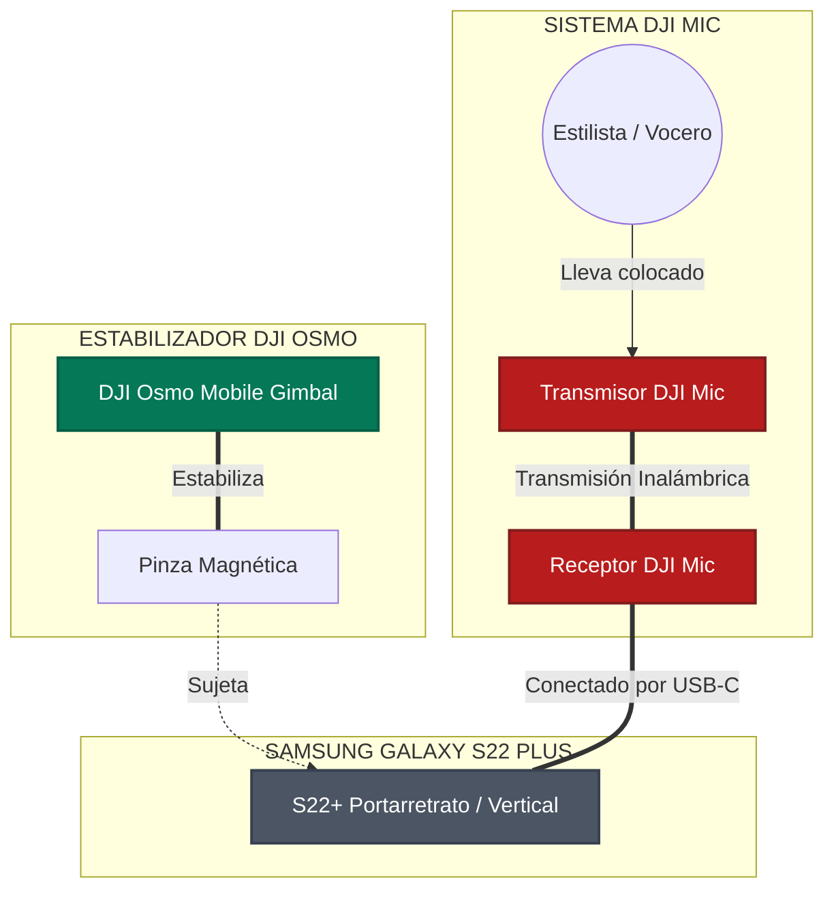

# 📘 MANUAL DE PRODUCCIÓN MÓVIL PREMIUM
## *Grabación Profesional de Truss en Dos Soles*

---

> [!IMPORTANT]
> **FORMATO DE LECTURA Y EXPORTACIÓN:** 
> Este documento ha sido estructurado con formato de alta fidelidad editorial. Si lo deseas, puedes imprimirlo directamente desde tu editor o exportarlo a PDF (usando la función "Exportar a PDF" de VS Code o tu navegador) para llevarlo impreso en papel o guardarlo en tu teléfono como manual de consulta rápida durante el evento.

---

## 🗺️ ÍNDICE DE CONTENIDOS
1. **Esquema de Conectividad y Flujo de Trabajo**
2. **Paso a Paso Visual: Configuración de Dispositivos**
3. **Guía Visual de Transiciones Físicas**
4. **La Biblioteca de Planos (Shot List Completa)**
5. **Cronograma de Trabajo para el Lunes (Minuto a Minuto)**
6. **Flujo de Edición Rápida y Profesional (CapCut)**
7. **Checklist Final de Supervivencia**

---

## 🔌 1. Esquema de Conectividad y Flujo de Trabajo

Para que entiendas cómo interactúan tus tres equipos principales, este es el mapa físico de cómo debe ir montado tu kit de grabación:



---

## ⚙️ 2. Paso a Paso Visual: Configuración de Dispositivos

Realiza estas configuraciones en orden estricto antes de salir de casa.

### 📱 PASO A PASO 1: Samsung Galaxy S22+
Configuraremos el teléfono para capturar la máxima calidad de color y movimiento compatible con redes.

```
Paso 1: Entrar a Cámara ➡️ Tocar ícono de Engranaje (Ajustes)
Paso 2: Buscar "Cuadrícula" ➡️ ACTIVAR (Muestra líneas guía de tercios)
Paso 3: Buscar "Estabilización de video" ➡️ DESACTIVAR (Para evitar conflictos con el Gimbal)
Paso 4: Volver a la pantalla de cámara ➡️ Cambiar formato a 9:16 (Vertical)
Paso 5: Seleccionar modo "Video" ➡️ Tocar arriba a la derecha ➡️ Ajustar a "FHD 60"
```

* **¿Por qué FHD 60?** Los 60 FPS (cuadros por segundo) hacen que el movimiento del cabello sea hiper fluido. Además, te permitirá ralentizar el video en edición a la mitad (cámara lenta al 50%) para lograr tomas cinematográficas espectaculares.

---

### 🕹️ PASO A PASO 2: DJI Osmo Mobile (Gimbal)
El balanceo físico correcto es el secreto para que los videos no salgan temblorosos y los motores del gimbal no se sobrecalienten.

```
[ PASO 1: PINZA MAGNÉTICA ]
Coloca la pinza magnética en el centro exacto del S22+. 
⚠️ La flecha blanca grabada en la pinza debe apuntar hacia la cámara del teléfono.

[ PASO 2: ACOPLE ]
Acopla la pinza magnética al imán del brazo del Gimbal.
⚠️ Asegúrate de que las marcas de alineación coincidan. No lo enciendas aún.

[ PASO 3: ENCENDIDO Y DESPLIEGUE ]
Despliega el brazo del gimbal. Se encenderá automáticamente.
El teléfono se nivelará de inmediato.

[ PASO 4: SELECCIÓN DE MODO ]
Presiona el botón "M" del gimbal para alternar entre modos:
➡️ FPV (Luz FPV en pantalla): El teléfono sigue todos tus movimientos de muñeca. Úsalo para transiciones dinámicas.
➡️ FOLLOW (Luz F): El teléfono se mantiene nivelado con el horizonte. Úsalo para tomas normales de paseo.
```

---

### 🎙️ PASO A PASO 3: DJI Mic (Audio)
El audio representa el 50% del éxito de un video. El público tolera un video con grano, pero descarta de inmediato un video que se escucha mal.

```
[ PASO 1: CONEXIÓN ]
Saca el Receptor (pantalla táctil) de la caja de carga.
Desliza el adaptador USB-C en la base del receptor.
Conéctalo firmemente en el puerto de carga de tu S22+.

[ PASO 2: VERIFICACIÓN ]
Enciende el receptor. Saca un Transmisor (micrófono).
Verifica en la pantalla del receptor que se encienda la barra de nivel (barra vertical que sube y baja al hablar).
Si se mueve, la señal está enlazada perfectamente.

[ PASO 3: EL CORTAVIENTOS (DEADCAT) ]
Inserta el protector peludo cortavientos (deadcat) en la parte superior del transmisor, girándolo en sentido horario hasta que trabe.
⚠️ ESTO ES OBLIGATORIO: Evita que el aire del secador sature la cápsula.

[ PASO 4: COLOCACIÓN ]
Coloca el micrófono al estilista a la altura del esternón (pecho central).
Usa el clip o el imán que incluye el DJI Mic por debajo de la remera para que quede firme y estético.
```

---

## 🎬 3. Guía Visual de Transiciones Físicas

Las transiciones físicas mantienen el ritmo y retienen la atención en las historias de Instagram y Reels. Aquí tienes las 3 más efectivas, dibujadas y detalladas paso a paso.

### 🔄 Transición 1: El Látigo Rápido (Whip Pan)
Crea una sensación de velocidad y cambio instantáneo de escena.

```
ESCENA A: El peluquero aplicando el producto Truss
🎥 Cámara: Grabando de cerca ➡️ Paneo ultra rápido hacia la DERECHA ➡️ CORTAR GRABACIÓN
                                                  ⬇️
                                      [Corte en la edición]
                                                  ⬇️
ESCENA B: El lavado de cabeza de la modelo
🎥 Cámara: Iniciar grabación con Paneo ultra rápido de IZQUIERDA a DERECHA ➡️ Frenar justo frente a la modelo
```

---

### 🧴 Transición 2: Bloqueo de Lente con Producto (Lens Block)
Una transición súper comercial e ideal para marcas de belleza.

```
ESCENA A: El peluquero sosteniendo la botella de Truss Uso Obligatorio
🎥 Cámara: Grabar al peluquero sosteniendo el envase.
👉 Acción: El peluquero empuja la botella rápidamente hacia la cámara hasta tapar la lente por completo (Pantalla a negro).
                                                  ⬇️
                                      [Corte en la edición]
                                                  ⬇️
ESCENA B: La modelo con el look finalizado
🎥 Cámara: Iniciar toma con la botella pegada a la lente (Pantalla a negro).
👉 Acción: Retirar la botella hacia atrás rápidamente para revelar el cabello brillante y sonriente de la modelo.
```

---

### 🪞 Transición 3: El Desenfoque de Lente (Bokeh / Focus Fade)
Una transición suave, de estilo editorial de belleza, que aprovecha las luces del salón para fundir escenas de forma artística.

```
ESCENA A: El proceso de coloración o lavado finalizado
🎥 Cámara: Tocar la base de la pantalla del celu o acercarse mucho a un objeto para desenfocar por completo la modelo (Pantalla desenfocada).
                                                  ⬇️
                                      [Corte en la edición]
                                                  ⬇️
ESCENA B: La modelo peinada con Brillo Espejo
🎥 Cámara: Iniciar toma desenfocada ➡️ Tocar la pantalla para que el autoenfoque del S22+ logre la nitidez total en un segundo sobre el cabello brillante.
```

---

### 🌀 Transición 4: El Giro de Vórtice (Spin / Roll Transition)
Una transición enérgica y dinámica basada en la rotación física para conectar el laboratorio técnico y el salón.

```
ESCENA A: El peluquero batiendo la crema en el bowl o aplicando
🎥 Cámara: Grabar la acción de forma estable ➡️ Rotar rápidamente la cámara de tu celu girando tu muñeca 180° a la izquierda ➡️ CORTAR.
                                                  ⬇️
                                      [Corte en la edición]
                                                  ⬇️
ESCENA B: La modelo ya finalizada
🎥 Cámara: Iniciar grabación rotando el gimbal hacia la izquierda otros 180° ➡️ Estabilizar al instante frente al cabello brillante de la modelo.
```

---

## 📸 4. La Biblioteca de Planos (Shot List Completa)

Lleva este checklist contigo el lunes para asegurarte de no volver a casa con material faltante. Haz al menos 3 tomas de cada uno.

### 🏢 Categoría A: Contexto e Introducción (El Gancho)
* [ ] **Plano 1: La entrada dinámica**: Camina con el gimbal hacia la entrada del centro técnico Dos Soles. Paso firme pero suave (caminata ninja).
* [ ] **Plano 2: El Peluquero Estrella**: Plano medio del estilista ordenando los productos sobre la mesada. Pídele que mire a la cámara, sonría y salude con la mano.
* [ ] **Plano 3: El Altar de Truss**: Toma general de la línea de productos Truss perfectamente ordenados bajo las luces del salón.

### 🧪 Categoría B: El Proceso Técnico (Detalles y Texturas)
* [ ] **Plano 4: El Unboxing del Producto**: Plano cerrado de las manos del peluquero abriendo la tapa o presionando el dosificador.
* [ ] **Plano 5: La Alquimia**: Plano macro (muy de cerca) de la mezcla de color o producto en el bowl. El batido con el pincel genera una textura cremosa espectacular en 60 FPS.
* [ ] **Plano 6: La Aplicación Detallada**: Plano medio y cerrado de los dedos del peluquero separando mechones y aplicando el producto con pinceladas precisas.
* [ ] **Plano 7: La Reacción Química**: Si el producto genera vapor, espuma o reposa bajo una lámpara térmica, graba un plano de ese proceso.

### 💦 Categoría C: Sensorial y Lavado
* [ ] **Plano 8: El Lavacabezas Cenital**: Graba desde arriba cómo cae el agua sobre el cabello. La caída del agua y la espuma en cámara lenta tienen un efecto hipnótico en redes.
* [ ] **Plano 9: El Masaje Capilar**: Plano cerrado de las manos del peluquero haciendo el masaje de lavado. Transmite relajación y cuidado premium.

### ✨ Categoría D: El Secado y la Revelación
* [ ] **Plano 10: El Soplo de Viento**: Graba el cabello volando con el aire del secador. Colócate a contraluz para que cada cabello brille.
* [ ] **Plano 11: El Movimiento de la Peineta**: El cepillo redondo deslizando por el mechón de cabello de arriba a abajo, revelando un lacio u ondas perfectas.
* [ ] **Plano 12: El Brillo Espejo**: Pídele a la modelo que mueva suavemente la cabeza de lado a lado. Capta el reflejo de la luz sobre el cabello (Brillo Truss).
* [ ] **Plano 13: La Gran Sonrisa (El Éxito)**: Plano medio de la modelo mirándose al espejo, tocándose el cabello con una sonrisa de felicidad.

---

## 📅 5. Cronograma de Trabajo para el Lunes (Minuto a Minuto)

Llegar organizado te dará tranquilidad y seguridad. Sigue este itinerario recomendado:

* **08:30 - Llegada e Inspección**:
  * Llega temprano. Ubica dónde están las mejores luces naturales (ventanales) y las luces artificiales del salón.
  * Encuentra un enchufe libre para dejar tu Power Bank cargando por si acaso.
* **08:45 - Conexión y Pruebas de Audio (¡Crucial!)**:
  * Conecta el receptor del DJI Mic a tu Samsung.
  * Pídele al peluquero que se coloque el micrófono. Haz una prueba de 10 segundos donde él hable fuerte.
  * **Ponte auriculares** y escucha la prueba. Asegúrate de que no haya un zumbido de fondo y de que su voz se escuche clara y nítida.
* **09:00 - Inicio de Demostración - Fase "Antes"**:
  * Toma fotos y videos del cabello de la modelo tal como llega (el "Antes").
  * Realiza los planos del altar de productos Truss.
* **09:30 - Fase de Aplicación y Mezcla**:
  * Graba el proceso de preparación del color y la aplicación técnica.
  * Mantén el gimbal en modo *Follow* para tomas estables o *FPV* para acercamientos rápidos.
* **11:00 - Fase de Lavado e Hidratación**:
  * Trasládate al lavacabezas con anticipación para buscar el mejor ángulo sin entorpecer el paso de los técnicos.
  * Captura las texturas del agua y la espuma.
* **12:30 - Fase de Secado y Revelación ("Después")**:
  * Graba el proceso de peinado y modelado del cabello.
  * Ejecuta las tomas de cámara lenta y las reacciones felices de la modelo.
* **13:30 - Tomas del Cierre**:
  * Pídele al peluquero que sostenga su producto favorito de Truss y diga un mensaje corto a la cámara (ej. *"¡Un éxito total la capacitación de hoy en Dos Soles con Truss! Miren este brillo..."*). Su voz grabada con el DJI Mic se escuchará impecable.

---

## ✂️ 6. Flujo de Edición Rápida y Profesional (CapCut)

Para armar tus videos de manera profesional y rápida desde tu teléfono, descarga la app **CapCut** (es gratuita y la más usada en la industria móvil). Sigue estos pasos para procesar tu material a 60 FPS:

```
Paso 1: Abre CapCut ➡️ Toca "Nuevo Proyecto" ➡️ Selecciona tus videos grabados.
Paso 2: Toca un clip de B-Roll (ej. el movimiento del cabello o el agua) ➡️ Toca "Velocidad" ➡️ Selecciona "Normal" ➡️ Ajusta a 0.5x.
        ➡️ Activa la opción "Tono" o "Cámara lenta fluida" si la app lo ofrece. ¡El cabello se verá súper sedoso!
Paso 3: Realiza los cortes de tus transiciones físicas. Haz que el corte ocurra exactamente en la mitad del movimiento rápido de la cámara.
Paso 4: Agrega una música en tendencia desde la biblioteca de CapCut o Instagram.
Paso 5: Si el peluquero explica algo técnico, agrega subtítulos automáticos:
        ➡️ Toca "Texto" ➡️ "Subtítulos automáticos" ➡️ Selecciona español y una plantilla de texto limpia y moderna.
Paso 6: EXPORTACIÓN (⚠️ Muy Importante):
        ➡️ Toca la resolución arriba a la derecha (por defecto dice 1080p).
        ➡️ Asegúrate de que la tasa de fotogramas esté ajustada a "60" para conservar la fluidez.
        ➡️ Presiona Exportar. ¡Listo para publicar en @dossoles.distribuidora!
```

---

## 📝 7. Checklist Final de Supervivencia

Antes de salir de tu casa el lunes por la mañana, verifica que tengas todo esto en tu mochila:

- [ ] **Samsung Galaxy S22+** (Con la lente de la cámara trasera pulida con microfibra).
- [ ] **Al menos 30 GB libres** de almacenamiento interno en el teléfono.
- [ ] **Estuche de carga de DJI Mic** con transmisores y receptor cargados al 100%.
- [ ] **Adaptador USB-C** del DJI Mic conectado magnéticamente en el receptor.
- [ ] **Protector de viento (Deadcat)** para el micrófono de solapa.
- [ ] **Gimbal DJI Osmo Mobile** con la batería cargada.
- [ ] **Pinza magnética del gimbal** (¡No la olvides pegada en otro lado!).
- [ ] **Batería externa (Power Bank)** y su cable USB-C de carga rápida.
- [ ] **Auriculares con cable o bluetooth** para monitorear el audio antes de empezar a grabar.

---

### ¡Mucha fuerza y éxito!
Tienes en tus manos la mejor tecnología móvil actual. Confía en la estabilidad del gimbal, sé meticuloso con el audio, busca la luz brillante sobre el cabello y disfruta del proceso de aprendizaje. ¡Vas a crear un contenido del que Dos Soles y Truss estarán sumamente orgullosos! 🚀
