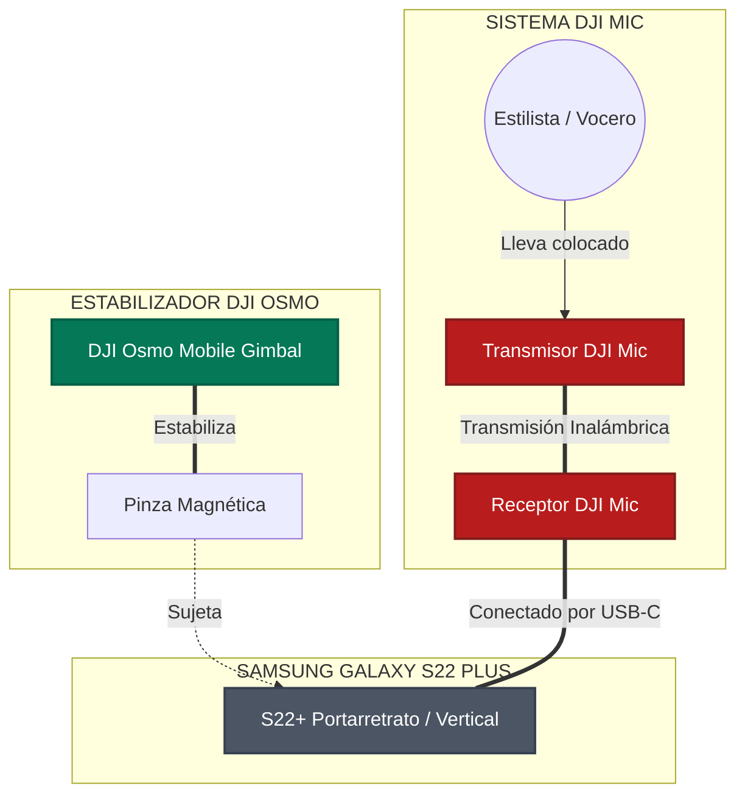
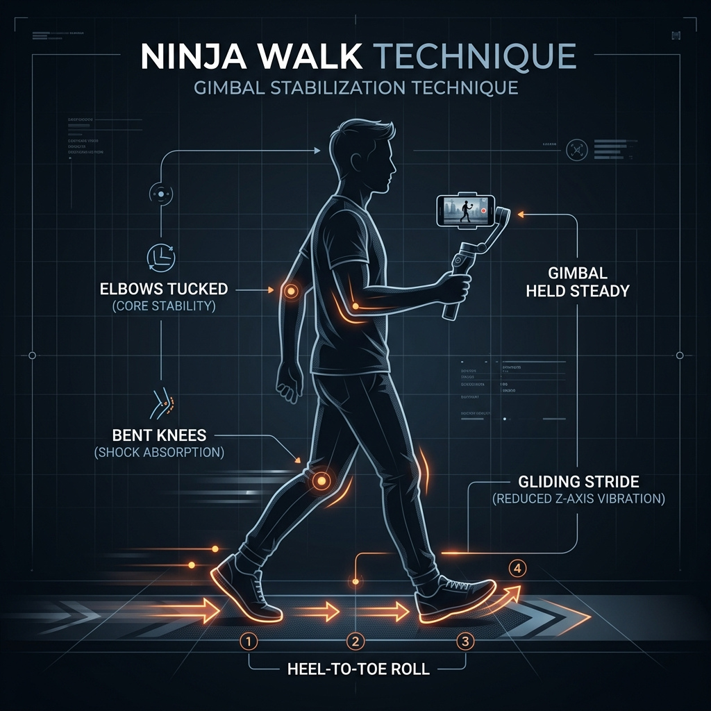

# 📘 MANUAL DE PRODUCCIÓN MÓVIL PREMIUM
## *Grabación Profesional de Truss en Dos Soles*

---

> [!IMPORTANT]
> **FORMATO DE LECTURA Y EXPORTACIÓN:** 
> Este documento ha sido estructurado con formato de alta fidelidad editorial. Si lo deseas, puedes imprimirlo directamente desde tu editor o exportarlo a PDF (usando la función "Exportar a PDF" de VS Code o tu navegador) para llevarlo impreso en papel o guardarlo en tu teléfono como manual de consulta rápida durante el evento.

---

## 🗺️ ÍNDICE DE CONTENIDOS
1. **Esquema de Conectividad y Flujo de Trabajo**
2. **Paso a Paso Visual: Configuración de Dispositivos**
3. **Guía Visual de Transiciones Físicas**
4. **La Biblioteca de Planos (Shot List Completa)**
5. **Cronograma de Trabajo para el Lunes (Minuto a Minuto)**
6. **Flujo de Edición Rápida y Profesional (CapCut)**
7. **Checklist Final de Supervivencia**

---

## 🔌 1. Esquema de Conectividad y Flujo de Trabajo

Para que entiendas cómo interactúan tus tres equipos principales, este es el mapa físico de cómo debe ir montado tu kit de grabación:



---

## ⚙️ 2. Paso a Paso Visual: Configuración de Dispositivos

Realiza estas configuraciones en orden estricto antes de salir de casa.

### 📱 PASO A PASO 1: Samsung Galaxy S22+
Configuraremos el teléfono para capturar la máxima calidad de color y movimiento compatible con redes.

```
Paso 1: Entrar a Cámara ➡️ Tocar ícono de Engranaje (Ajustes)
Paso 2: Buscar "Cuadrícula" ➡️ ACTIVAR (Muestra líneas guía de tercios)
Paso 3: Buscar "Estabilización de video" ➡️ DESACTIVAR (Para evitar conflictos con el Gimbal)
Paso 4: Volver a la pantalla de cámara ➡️ Cambiar formato a 9:16 (Vertical)
Paso 5: Seleccionar modo "Video" ➡️ Tocar arriba a la derecha ➡️ Ajustar a "FHD 60"
```

* **¿Por qué FHD 60?** Los 60 FPS (cuadros por segundo) hacen que el movimiento del cabello sea hiper fluido. Además, te permitirá ralentizar el video en edición a la mitad (cámara lenta al 50%) para lograr tomas cinematográficas espectaculares.

---

### 🕹️ PASO A PASO 2: DJI Osmo Mobile (Gimbal)
El balanceo físico correcto es el secreto para que los videos no salgan temblorosos y los motores del gimbal no se sobrecalienten.

```
[ PASO 1: PINZA MAGNÉTICA ]
Coloca la pinza magnética en el centro exacto del S22+. 
⚠️ La flecha blanca grabada en la pinza debe apuntar hacia la cámara del teléfono.

[ PASO 2: ACOPLE ]
Acopla la pinza magnética al imán del brazo del Gimbal.
⚠️ Asegúrate de que las marcas de alineación coincidan. No lo enciendas aún.

[ PASO 3: ENCENDIDO Y DESPLIEGUE ]
Despliega el brazo del gimbal. Se encenderá automáticamente.
El teléfono se nivelará de inmediato.

[ PASO 4: SELECCIÓN DE MODO ]
Presiona el botón "M" del gimbal para alternar entre modos:
➡️ FPV (Luz FPV en pantalla): El teléfono sigue todos tus movimientos de muñeca. Úsalo para transiciones dinámicas.
➡️ FOLLOW (Luz F): El teléfono se mantiene nivelado con el horizonte. Úsalo para tomas normales de paseo.
```

---

### 🔬 TEST DE 2 SEGUNDOS (Micro-diagnóstico en el Salón)
Si estás en el salón técnico de Dos Soles y quieres verificar en 2 segundos si el gimbal está en el modo correcto sin mirar la pantalla de la app, haz este test físico rápido moviendo tu mano:

* **Para comprobar modo [PTF ⌖] (Pan & Tilt Follow)**: Mueve el gimbal hacia los lados y arriba/abajo. El teléfono debe seguirte con suavidad. Ahora inclina tu muñeca hacia los lados (lateralmente): el teléfono debe mantenerse recto con el horizonte.
* **Para comprobar modo [PF ⌂] (Pan Follow)**: Mueve el gimbal hacia los lados (debe seguirte). Mueve el gimbal hacia arriba/abajo: el teléfono debe quedarse apuntando fijo al frente sin subir ni bajar la mirada.
* **Para comprobar modo [FPV 🖾] (3D Follow)**: Mueve el gimbal hacia los lados, arriba/abajo, e inclina tu muñeca lateralmente. El teléfono debe seguirte en todos los ángulos (incluyendo inclinación lateral/roll).
* **Para comprobar modo [LOCK 🔒] (Bloqueado)**: Mueve tu mano en cualquier dirección. El teléfono debe quedarse inmóvil apuntando a un punto fijo del salón, como congelado.

---

### 📊 REGLA DE ORO: Joystick vs. Mano/Cuerpo
Usa esta regla definitiva para saber cuándo usar los controles físicos del gimbal y cuándo confiar en tus propios movimientos corporales en Dos Soles:

| Situación / Tipo de Plano | 🕹️ Joystick (Cuándo usar) | 🚶‍♂️ Mano y Cuerpo (Cuándo usar) |
| :--- | :--- | :--- |
| **Paneo Horizontal o Vertical Estático** (ej. Paneos lentos del Altar de Productos) | **SÍ (Recomendado)**. Apoya el gimbal en una mesa firme o trípode y usa el joystick para un barrido perfectamente lineal a velocidad constante. | **NO**. Generará pequeños rebotes si estás parado en un solo lugar intentando rotar el cuerpo. |
| **Seguimientos Dinámicos** (ej. Seguir a la modelo caminando, tomas de lavado cenital) | **NO**. El joystick es muy rígido y lineal. Hace que la toma parezca artificial. | **SÍ (Recomendado)**. Camina con la *Caminata Ninja* y apunta la cámara girando y deslizando tu propio cuerpo de forma orgánica. |
| **Transiciones Rápidas** (ej. Whip Pan o Spin Vortex) | **NO**. Los motores del joystick limitan la velocidad máxima. | **SÍ (Recomendado)**. Gira la muñeca de golpe físicamente en modo **FPV**. El motor te acompañará al instante con fuerza. |
| **Toma Macro de Detalle de Textura** (ej. La Alquimia o gotas de producto) | **SÍ**. Para corregir milimétricamente el encuadre cerrado sin tener que reposicionar todo tu cuerpo. | **NO**. Un milímetro de vibración corporal en una toma tan de cerca se notará como un temblor gigante. |

---

### 🎙️ PASO A PASO 3: DJI Mic (Audio)
El audio representa el 50% del éxito de un video. El público tolera un video con grano, pero descarta de inmediato un video que se escucha mal.

```
[ PASO 1: CONEXIÓN ]
Saca el Receptor (pantalla táctil) de la caja de carga.
Desliza el adaptador USB-C en la base del receptor.
Conéctalo firmemente en el puerto de carga de tu S22+.

[ PASO 2: VERIFICACIÓN ]
Enciende el receptor. Saca un Transmisor (micrófono).
Verifica en la pantalla del receptor que se encienda la barra de nivel (barra vertical que sube y baja al hablar).
Si se mueve, la señal está enlazada perfectamente.

[ PASO 3: EL CORTAVIENTOS (DEADCAT) ]
Inserta el protector peludo cortavientos (deadcat) en la parte superior del transmisor, girándolo en sentido horario hasta que trabe.
⚠️ ESTO ES OBLIGATORIO: Evita que el aire del secador sature la cápsula.

[ PASO 4: COLOCACIÓN ]
Coloca el micrófono al estilista a la altura del esternón (pecho central).
Usa el clip o el imán que incluye el DJI Mic por debajo de la remera para que quede firme y estético.
```

---

## 🎬 3. Guía Visual de Transiciones Físicas

Las transiciones físicas mantienen el ritmo y retienen la atención en las historias de Instagram y Reels. Aquí tienes las 4 más efectivas, dibujadas y detalladas paso a paso con su modo DJI de referencia.

### 🔄 Transición 1: El Látigo Rápido (Whip Pan) `[FPV 🖾]`
Crea una sensación de velocidad y cambio instantáneo de escena.

```
🕹️ Modo del Estabilizador: [FPV 🖾]
ESCENA A: El peluquero aplicando el producto Truss
🎥 Cámara: Grabando de cerca ➡️ Paneo ultra rápido hacia la DERECHA ➡️ CORTAR GRABACIÓN
                                                  ⬇️
                                      [Corte en la edición]
                                                  ⬇️
ESCENA B: El lavado de cabeza de la modelo
🎥 Cámara: Iniciar grabación con Paneo ultra rápido de IZQUIERDA a DERECHA ➡️ Frenar justo frente a la modelo
```

---

### 🧴 Transición 2: Bloqueo de Lente con Producto (Lens Block) `[PTF ⌖]`
Una transición súper comercial e ideal para marcas de belleza.

```
🕹️ Modo del Estabilizador: [PTF ⌖]
ESCENA A: El peluquero sosteniendo la botella de Truss Uso Obligatorio
🎥 Cámara: Grabar al peluquero sosteniendo el envase.
👉 Acción: El peluquero empuja la botella rápidamente hacia la cámara hasta tapar la lente por completo (Pantalla a negro).
                                                  ⬇️
                                      [Corte en la edición]
                                                  ⬇️
ESCENA B: La modelo con el look finalizado
🎥 Cámara: Iniciar toma con la botella pegada a la lente (Pantalla a negro).
👉 Acción: Retirar la botella hacia atrás rápidamente para revelar el cabello brillante y sonriente de la modelo.
```

---

### 🪞 Transición 3: El Desenfoque de Lente (Bokeh / Focus Fade) `[PTF ⌖]`
Una transición suave, de estilo editorial de belleza, que aprovecha las luces del salón para fundir escenas de forma artística.

```
🕹️ Modo del Estabilizador: [PTF ⌖]
ESCENA A: El proceso de coloración o lavado finalizado
🎥 Cámara: Tocar la base de la pantalla del celu o acercarse mucho a un objeto para desenfocar por completo la modelo (Pantalla desenfocada).
                                                  ⬇️
                                      [Corte en la edición]
                                                  ⬇️
ESCENA B: La modelo peinada con Brillo Espejo
🎥 Cámara: Iniciar toma desenfocada ➡️ Tocar la pantalla para que el autoenfoque del S22+ logre la nitidez total en un segundo sobre el cabello brillante.
```

---

### 🌀 Transición 4: El Giro de Vórtice (Spin / Roll Transition) `[FPV 🖾] / [SPINSHOT ⟳]`
Una transición enérgica y dinámica basada en la rotación física para conectar el laboratorio técnico y el salón.

```
🕹️ Modo del Estabilizador: [FPV 🖾] o [SPINSHOT ⟳]
ESCENA A: El peluquero batiendo la crema en el bowl o aplicando
🎥 Cámara: Grabar la acción de forma estable ➡️ Rotar rápidamente la cámara de tu celu girando tu muñeca 180° a la izquierda ➡️ CORTAR.
                                                  ⬇️
                                      [Corte en la edición]
                                                  ⬇️
ESCENA B: La modelo ya finalizada
🎥 Cámara: Iniciar grabación rotando el gimbal hacia la izquierda otros 180° ➡️ Estabilizar al instante frente al cabello brillante de la modelo.
```

---

## 📸 4. La Biblioteca de Planos (Shot List Completa)

Lleva este checklist contigo el lunes para asegurarte de no volver a casa con material faltante. Haz al menos 3 tomas de cada uno. Junto a cada toma encontrarás el modo del estabilizador DJI recomendado.

> [!TIP]
> **🚶‍♂️ EL SECRETO DE LA ESTABILIDAD: LA CAMINATA NINJA**
> Para evitar el rebote vertical que el estabilizador no puede absorber, flexiona ligeramente tus rodillas, camina talón-punta deslizando tus pies con suavidad y mantén los codos pegados a tus costados.
> 

### 🏢 Categoría A: Contexto e Introducción (El Gancho)
* [ ] **Plano 1: La entrada dinámica** `[PTF ⌖]`: Camina con el gimbal hacia la entrada del centro técnico Dos Soles. Paso firme pero suave (caminata ninja).
  * 🪜 **TÉCNICA DE ESCALERAS (Tip de Supervivencia):** Si para ingresar al salón tienes que subir escaleras:
    1. **La Caminata de Resorte:** Apoya primero la punta del pie en el escalón y luego baja suavemente el talón, subiendo con un ritmo lento y constante (las piernas flexionadas actúan como suspensión).
    2. **Suspensión Manual:** Mantén tu codo flexionado a 90 grados separado del torso (actuando como brazo hidráulico de grúa) y sujeta el gimbal con **ambas manos** para duplicar la estabilidad y absorber los saltos del eje Z (rebote vertical).
    3. **Efecto de Cine Invertido (Under-slung):** Gira el gimbal completamente boca abajo (de cabeza). Graba a ras del suelo apuntando a los escalones mientras subes lentamente. Esto disimula el temblor vertical al 100% y genera un encuadre hiperprofesional espectacular.
* [ ] **Plano 2: El Peluquero Estrella** `[LOCK 🔒]`: Plano medio del estilista ordenando los productos sobre la mesada. Pídele que mire a la cámara, sonría y salude con la mano.
* [ ] **Plano 3: El Altar de Truss** `[PF ⌂]`: Toma general de la línea de productos Truss perfectamente ordenados bajo las luces del salón.

### 🧪 Categoría B: El Proceso Técnico (Detalles y Texturas)
* [ ] **Plano 4: El Unboxing del Producto** `[PF ⌂]`: Plano cerrado de las manos del peluquero abriendo la tapa o presionando el dosificador.
* [ ] **Plano 5: La Alquimia** `[PF ⌂]`: Plano macro (muy de cerca) de la mezcla de color o producto en el bowl. El batido con el pincel genera una textura cremosa espectacular en 60 FPS.
* [ ] **Plano 6: La Aplicación Detallada** `[PTF ⌖]`: Plano medio y cerrado de los dedos del peluquero separando mechones y aplicando el producto con pinceladas precisas.
* [ ] **Plano 7: La Reacción Química** `[PTF ⌖]`: Si el producto genera vapor, espuma o reposa bajo una lámpara térmica, graba un plano de ese proceso.

### 💦 Categoría C: Sensorial y Lavado
* [ ] **Plano 8: El Lavacabezas Cenital** `[PTF ⌖]`: Graba desde arriba cómo cae el agua sobre el cabello. La caída del agua y la espuma en cámara lenta tienen un efecto hipnótico en redes.
* [ ] **Plano 9: El Masaje Capilar** `[PTF ⌖]`: Plano cerrado de las manos del peluquero haciendo el masaje de lavado. Transmite relajación y cuidado premium.

### ✨ Categoría D: El Secado y la Revelación
* [ ] **Plano 10: El Soplo de Viento** `[PTF ⌖]`: Graba el cabello volando con el aire del secador. Colócate a contraluz para que cada cabello brille.
* [ ] **Plano 11: El Movimiento de la Peineta** `[PTF ⌖]`: El cepillo redondo deslizando por el mechón de cabello de arriba a abajo, revelando un lacio u ondas perfectas.
* [ ] **Plano 12: El Brillo Espejo** `[PTF ⌖]`: Pídele a la modelo que mueva suavemente la cabeza de lado a lado. Capta el reflejo de la luz sobre el cabello (Brillo Truss).
* [ ] **Plano 13: La Gran Sonrisa (El Éxito)** `[LOCK 🔒]`: Plano medio de la modelo mirándose al espejo, tocándose el cabello con una sonrisa de felicidad.

---

## 📅 5. Cronograma de Trabajo para el Lunes (Minuto a Minuto Técnico y de Publicación)

Sigue este itinerario paso a paso el lunes para coordinar las tomas con la publicación de historias en vivo en Dos Soles:

* **08:30 — Llegada e Inspección Visual (Scouting de Luces)**:
  * **Acción:** Recorre el Centro Técnico Dos Soles. Identifica los mejores ventanales con luz natural y reflectores. Busca dónde dejar tu batería externa (Power Bank) cargando como respaldo.
  * **Cámara:** Pasa el paño de microfibra por los lentes de tu S22+.
* **08:45 — Conexión y Pruebas de Audio Críticas (Con DJI Mic Mini)**:
  * **Acción:** Enchufa el receptor en tu Samsung (o haz el enlace por Bluetooth). Sujeta el micrófono de solapa al peluquero con el cortavientos de felpa (deadcat).
  * **Prueba:** Grábalo hablando 10 segundos, **ponte tus auriculares** y escúchalo. Debe sonar nítido y libre del zumbido del aire acondicionado.
  * **Configuración:** Activa el canal **Mono** (audio centrado), la **Pista de Seguridad** a -6dB (para evitar roturas si grita o ríe) y el **Corte Bajo (Low Cut)** para filtrar ruidos graves.
* **09:00 — Historia 1: El Gancho (Publicar la Llegada)**:
  * **Acción:** Graba la Toma 1 (La Entrada Dinámica). 
  * **Estabilizador:** `[PTF ⌖]`. Entra con paso ninja (rodillas flexionadas, deslizando talones) cruzando la puerta de Dos Soles en un plano continuo de 5 segundos.
  * **Publicación:** Sube este video a tus historias con la música en tendencia de fondo.
  * **Texto en pantalla:** *"¡Buen día! Hoy nos vinimos al Centro Técnico de Dos Soles porque se viene algo increíble con TRUSS... 💆‍♀️✨"*
* **09:15 — Historia 2: El Protagonista (Presentando al Peluquero)**:
  * **Acción:** Graba la Toma 2 (Plano medio del peluquero ordenando productos Truss y saludando a la cámara).
  * **Estabilizador:** `[LOCK 🔒]`.
  * **Audio (DJI Mic):** El peluquero diciendo: *"¡Hola a todos! Hoy vamos a hacer una reconstrucción profunda con Truss en el salón técnico..."*
  * **Publicación:** Sube el video como Historia 2.
  * **Texto en pantalla:** *"Hoy nos acompaña [Nombre del Estilista] para mostrarnos la magia técnica de Truss."*
* **10:00 — Historia 3: La Alquimia (Preparación de la Mezcla)**:
  * **Acción:** Graba la Toma 5 (La Alquimia).
  * **Estabilizador:** `[FPV 🖾]`. Enfoca de muy cerca el pincel batiendo el color Truss en el bowl de vidrio. A los 4 segundos, gira la muñeca rápido a la DERECHA haciendo un barrido físico borroso y corta la toma.
  * **Transición de Salida:** **Whip Pan (Out - Hacia la Derecha)** ➡️ Conecta con la Historia 4.
  * **Publicación:** Sube esta toma a velocidad de cámara lenta (0.5x en CapCut) como Historia 3.
  * **Texto en pantalla:** *"Preparando la fórmula perfecta de Truss. Miren esta textura... 🧪🎨"*
* **10:30 — Historia 4: Tip Técnico Educativo (Aplicación - B2B)**:
  * **Acción:** Graba la Toma 6 (Aplicación del tinte).
  * **Transición de Entrada:** **Whip Pan (In - De Izquierda a Derecha)** ➡️ Inicia la grabación barriendo rápido hacia la derecha y frena el plano suavemente en las manos del estilista pasando el pincel.
  * **Estabilizador:** `[FPV 🖾]` (durante el barrido de entrada) ➡️ `[PTF ⌖]` (para la explicación).
  * **Audio (DJI Mic):** El estilista dando un tip técnico: *"El secreto de Truss es saturar bien las secciones finas para reconstruir los enlaces químicos de la cutícula"*.
  * **Transición de Salida:** **Spin Vortex (Out - Giro 180° Izquierda)** ➡️ Al terminar de hablar, rota tu muñeca bruscamente hacia la izquierda haciendo que el plano gire con efecto vórtice y corta. Conecta con la Historia 5.
  * **Publicación:** Sube el clip como Historia 4.
  * **Texto en pantalla:** *"Tip de experto: Saturación homogénea en secciones finas."*
* **11:30 — Historia 5: Momento Sensorial (Relajación en Lavacabezas)**:
  * **Acción:** Graba la Toma 7 y 8 (Lavado Cenital).
  * **Transición de Entrada:** **Spin Vortex (In - Giro 180° Izquierda a Centro)** ➡️ Inicia grabando girando tu muñeca rápidamente hacia la izquierda y estabiliza el plano al instante apuntando cenitalmente al lavacabezas.
  * **Estabilizador:** `[FPV 🖾]` (en el giro) ➡️ `[PTF ⌖]` (cenital apuntando hacia abajo). Capta la caída del agua y el masaje capilar con la espuma blanca en cámara lenta.
  * **Transición de Salida:** **Bokeh Focus Blur (Out - Forzar Desenfoque)** ➡️ Acerca la lente muy cerca de la espuma o de una botella de Truss para forzar que el fondo se desenfoque por completo en burbujas artísticas y corta. Conecta con la Historia 6.
  * **Publicación:** Sube como Historia 5 silenciando el audio original del salón de teñido.
  * **Texto en pantalla:** *"Momento de relax e hidratación en el lavacabezas... ¿sentís el aroma? 💆‍♀️💦"*
  * **Música:** Agrega una melodía zen súper suave de fondo.
* **12:45 — Historia 6: La Tensión (Secado y Viento)**:
  * **Acción:** Graba la Toma 9 (Secador volando el pelo brillante a contraluz).
  * **Transición de Entrada:** **Bokeh Focus Blur (In - Recuperar Foco)** ➡️ Inicia la grabación con la lente forzadamente desenfocada y, a los 2 segundos, toca la pantalla de tu S22+ sobre el cabello de la modelo para que el autoenfoque viaje suavemente a la nitidez total del secado.
  * **Estabilizador:** `[PTF ⌖]`.
  * **Transición de Salida:** **Lens Block (Out - Bloqueo de Cámara)** ➡️ Al finalizar, pídele al estilista que empuje una botella de *Truss Uso Obligatorio* rápido hacia la cámara hasta tocar la lente trasera protectora y taparla al 100% (pantalla a negro). Corta la toma. Conecta con la Historia 7.
  * **Publicación:** Sube la Historia 6 agregando un **Sticker de Encuesta Interactiva** (*"¿Lacio o con Ondas?"* o *"¿Quieren ver el resultado?"*).
  * **Texto en pantalla:** *"El secado final... ¡miren este brillo! Falta poco para revelar el look."*
* **13:15 — Historia 7: ¡LA REVELACIÓN MÁGICA! (El Después)**:
  * **Acción:** Revelación de look final.
  * **Transición de Entrada:** **Lens Block (In - Revelación desde Negro)** ➡️ Sostén la botella de Truss tapando la cámara (pantalla a negro) y, al dar a grabar, retírala rápidamente en línea recta hacia atrás para revelar el cabello ultra brillante, sin frizz y sedoso de la modelo sonriendo.
  * **Estabilizador:** `[PTF ⌖]`.
  * **Publicación:** Sube la Historia 7. La música enérgica debe explotar con un beat-drop justo cuando retiras el envase.
  * **Texto en pantalla:** *"¡BOMBA! Reconstrucción Truss con Brillo Espejo. ¡Miren esta soltura y salud capilar! 😍💎"*
* **13:45 — Historia 8: Cierre y Ventas (Llamado a la Acción B2B)**:
  * **Acción:** Graba la Toma 10 (Testimonio final). El peluquero y la modelo sonrientes sosteniendo la línea Truss.
  * **Estabilizador:** `[LOCK 🔒]`.
  * **Audio (DJI Mic):** El peluquero diciendo: *"Trabajar con Truss en Dos Soles es otro nivel. Si querés capacitarte o conseguir la línea en tu salón, tocá el enlace aquí abajo"*.
  * **Publicación:** Sube la Historia 8 agregando un **Sticker de Enlace** al WhatsApp de ventas de la distribuidora.
  * **Texto en pantalla:** *"Escribí 'QUIERO TRUSS' y te mandamos el catálogo por privado"*.

---

## 🎨 5.1. Guía de Diseño, Tipografías y Menciones Premium en Instagram

Optimiza la estética de tus historias para reflejar la calidad de alta gama de **Truss** y la identidad profesional de **Dos Soles** utilizando exclusivamente las herramientas nativas de la aplicación de Instagram:

### 🏷️ 1. El Arte de Arrobar con Estilo (Menciones Premium)
Mencionar a las marcas involucradas (**@dossoles.distribuidora** y **@trusshair** / **@trussprofessional**) es indispensable para que puedan compartir tus historias, multiplicando el alcance de tu trabajo. Aplica uno de estos 3 estilos para hacerlo de forma elegante:

1. **La Mención Integrada (Recomendado - Limpio)**: 
   Evita arrobar usando stickers gigantes y coloridos de Instagram. En su lugar, escribe el arroba directamente en el cuerpo del texto de tu copy usando la tipografía **Classic (Sans-Serif)**.
   * *Ejemplo:* `¡Buen día! ☀️ Ya estamos en el Centro Técnico de @dossoles.distribuidora listos para un día de transformación con @trusshair ✨`
   * *Tip de Color:* Usa la herramienta "gotero" de Instagram para pintar la mención con un tono que ya exista en el video (un tono blanco tiza o amarillo dorado cobrizo extraído del brillo del cabello), fundiendo la tipografía perfectamente en la imagen.
2. **La Mención Fantasma (Ninja Style - Para tomas ultra limpias)**:
   Si tienes un clip cinematográfico impecable en cámara lenta y quieres que las marcas lo compartan pero no quieres colocar ningún texto que tape la imagen:
   * Escribe los arrobas: **@dossoles.distribuidora** y **@trusshair**.
   * Con dos dedos sobre la pantalla, pellizca el texto hasta hacerlo **microscópico (invisible al ojo)**.
   * Arrastra el arroba hacia un costado de la pantalla o escóndelo detrás de un Sticker de Encuesta/Enlace. Las marcas recibirán la notificación al instante para compartir la historia, pero tu video se verá limpio, profesional e inmaculado de textos.
3. **El Botón Interactivo de Marca**:
   Si quieres que la gente toque la mención de la distribuidora para comprar, escribe **@dossoles.distribuidora** en el modo de texto clásico y activa el fondo rectangular blanco de la tipografía. Redúcelo a un tamaño sutil y colócalo abajo al centro. Actúa como un botón estético y elegante que invita a hacer clic.

### ✍️ 2. El Sistema de Tipografías Premium (Font Pairings)
Instagram ofrece 9 fuentes nativas. Si las mezclas de forma aleatoria, tus historias se verán descuidadas. Para Dos Soles, implementa estrictamente una de estas dos fórmulas de combinación tipográfica:

* **FÓRMULA A: "Alta Moda Editorial" (Serif + Classic spaced)**
  * *Uso principal:* Historias de revelación de look final, tips técnicos B2B, y frases destacadas.
  * *Título:* Usa la fuente **Editor** (fuente número 9, estilo elegante con Serif) en minúsculas y cursiva. Escribe textos cortos (ej: *la alquimia del color* o *brillo espejo*).
  * *Subtítulo:* Justo abajo, escribe una descripción corta con la fuente **Classic** (fuente número 1, Sans-serif) en **MAYÚSCULAS** y agrega espacios manuales entre letras para darle aire. (ej: `D E T A L L E   T É C N I C O` o `C A P A C I T A C I Ó N   T R U S S`).
  * *Resultado:* Look de revista de moda de alto nivel, ideal para salones de belleza premium.
* **FÓRMULA B: "Estilo Dinámico Moderno" (Strong + Neon accent)**
  * *Uso principal:* Historias de procesos rápidos en vivo, unboxing de productos, y llamadas a la acción rápidas.
  * *Título:* Usa la fuente **Strong** (fuente Sans-serif negrita) en mayúsculas con el fondo de color activado en negro translúcido para asegurar legibilidad.
  * *Palabra clave:* Agrega un pequeño acento manuscrito con la fuente **Neon** (fuente cursiva manuscrita) superpuesta ligeramente inclinada en una esquina para destacar una palabra clave (ej: *magia*, *increíble*, *hoy*).

### 💬 3. Biblioteca Completa de Captions e Interactividad (Historia por Historia)
Lleva esta lista de copys listos para copiar y pegar directamente sobre tus videos para no perder tiempo redactando el lunes:

* **09:00 — Historia 1 (El Gancho)**:
  * *Texto:* `¡Buen día! ☀️ Ya estamos en el Centro Técnico de @dossoles.distribuidora listos para revelar el poder de la reconstrucción activa con @trusshair 💆‍♀️✨`
  * *Estilo:* Fórmula A (Título cursiva elegante, subtítulo clásico spaced).
  * *Ubicación:* Esquina superior izquierda.
* **09:15 — Historia 2 (El Protagonista)**:
  * *Texto:* `Hoy nos acompaña el gran @estilista para mostrarnos los secretos técnicos detrás del Brillo Espejo de Truss 🔬🎨`
  * *Estilo:* Mención Integrada. Gotero de color para pintar el arroba del estilista a tono.
* **10:00 — Historia 3 (La Alquimia)**:
  * *Texto:* `La alquimia perfecta. 🧪 Mezclando nutrición profunda para restaurar la cutícula capilar desde adentro. #TrussHair`
  * *Estilo:* Fuente Classic spaced colocada abajo a la izquierda.
* **10:30 — Historia 4 (Tip Técnico)**:
  * *Texto:* `Tip de experto: Saturación homogénea en secciones finas para garantizar una nutrición pareja y duradera 💎✨`
  * *Estilo:* Fórmula B (Strong en mayúsculas + palabra acento *secreto* en Neon cursiva).
* **11:30 — Historia 5 (Lavacabezas)**:
  * *Texto:* `Silencio... 🤫 momento de relajación absoluta y sellado térmico capilar en @dossoles.distribuidora 💆‍♀️💦`
  * *Estilo:* Oculta las menciones con la técnica de la *Mención Fantasma* para que el plano zen cenital del agua luzca inmaculado.
* **12:45 — Historia 6 (La Tensión)**:
  * *Texto:* `El secado final... ¡Miren cómo vuela este cabello sin frizz! ¿Qué dicen... Lacio perfecto o con Ondas? 👇🗳️`
  * *Estilo:* Inserta un **Sticker de Encuesta Interactiva** nativo de Instagram con dos botones: [Lacio Perfecto 😍] / [Ondas con Onda! ✨].
* **13:15 — Historia 7 (¡La Revelación!)**:
  * *Texto:* `¡BOMBA! 💣 Reconstrucción profunda Truss con Brillo Espejo real. Miren esta soltura, salud capilar y movimiento... ¡Un sueño! 😍✨ @trusshair`
  * *Estilo:* Mención destacada con botón rectangular blanco elegante abajo en el centro.
* **13:45 — Historia 8 (Cierre y Ventas)**:
  * *Texto:* `¿Querés llevar los tratamientos de @trusshair a tu salón o capacitarte en el Centro Técnico de @dossoles.distribuidora? Escribí QUIERO TRUSS y te mandamos catálogo y fechas por privado 📲👇`
  * *Estilo:* Agrega el **Sticker de Enlace** nativo con el link directo al WhatsApp de ventas de Dos Soles, personalizado con el texto del botón: `Consultar Catálogo Truss 📲`.

---

## ✂️ 6. Flujo de Edición Rápida y Profesional (CapCut)

Para armar tus videos de manera profesional y rápida desde tu teléfono, descarga la app **CapCut** (es gratuita y la más usada en la industria móvil). Sigue estos pasos para procesar tu material a 60 FPS:

```
Paso 1: Abre CapCut ➡️ Toca "Nuevo Proyecto" ➡️ Selecciona tus videos grabados.
Paso 2: Toca un clip de B-Roll (ej. el movimiento del cabello o el agua) ➡️ Toca "Velocidad" ➡️ Selecciona "Normal" ➡️ Ajusta a 0.5x.
        ➡️ Activa la opción "Tono" o "Cámara lenta fluida" si la app lo ofrece. ¡El cabello se verá súper sedoso!
Paso 3: Realiza los cortes de tus transiciones físicas. Haz que el corte ocurra exactamente en la mitad del movimiento rápido de la cámara.
Paso 4: Agrega una música en tendencia desde la biblioteca de CapCut o Instagram.
Paso 5: Si el peluquero explica algo técnico, agrega subtítulos automáticos:
        ➡️ Toca "Texto" ➡️ "Subtítulos automáticos" ➡️ Selecciona español y una plantilla de texto limpia y moderna.
Paso 6: EXPORTACIÓN (⚠️ Muy Importante):
        ➡️ Toca la resolución arriba a la derecha (por defecto dice 1080p).
        ➡️ Asegúrate de que la tasa de fotogramas esté ajustada a "60" para conservar la fluidez.
        ➡️ Presiona Exportar. ¡Listo para publicar en @dossoles.distribuidora!
```

---

## 📝 7. Checklist Final de Supervivencia

Antes de salir de tu casa el lunes por la mañana, verifica que tengas todo esto en tu mochila:

- [ ] **Samsung Galaxy S22+** (Con la lente de la cámara trasera pulida con microfibra).
- [ ] **Al menos 30 GB libres** de almacenamiento interno en el teléfono.
- [ ] **Estuche de carga de DJI Mic** con transmisores y receptor cargados al 100%.
- [ ] **Adaptador USB-C** del DJI Mic conectado magnéticamente en el receptor.
- [ ] **Protector de viento (Deadcat)** para el micrófono de solapa.
- [ ] **Gimbal DJI Osmo Mobile** con la batería cargada.
- [ ] **Pinza magnética del gimbal** (¡No la olvides pegada en otro lado!).
- [ ] **Batería externa (Power Bank)** y su cable USB-C de carga rápida.
- [ ] **Auriculares con cable o bluetooth** para monitorear el audio antes de empezar a grabar.

---

## 🧪 8. Protocolo de Pruebas de Campo en el Salón (On-Site Pre-Flight Check)

No inicies la grabación real el lunes sin completar este protocolo de pruebas rápidas de 5 minutos directamente en el salón técnico de Dos Soles. Esto te evitará volver a casa con audio saturado por los secadores o tomas temblorosas por falta de balanceo.

### 🕹️ Prueba A: Test de Calibración e Inercia del Gimbal (DJI Osmo Mobile)
* **Objetivo Técnico:** Asegurar que los motores no vibren ni se sobrecalienten, y que el horizonte de la cámara del S22+ esté 100% nivelado.
* **Paso a Paso en el Salón:**
  1. **Montaje Estático:** Sin encender el gimbal, acopla el S22+. Asegúrate de que el teléfono esté perfectamente centrado en la pinza (no debe estar cargado hacia un lado).
  2. **Encendido en Plano:** Apoya el trípode del DJI Osmo sobre la mesa de productos (una superficie plana). Despliega el brazo y deja que se encienda solo.
  3. **Auto-Calibración (⚠️ Muy Útil):** Si notas que la cámara está ligeramente inclinada hacia un costado:
     * Abre la app DJI Mimo ➡️ Ve a *Ajustes* ➡️ Selecciona *Auto-Calibración del Gimbal*. Espera 10 segundos sin tocar el equipo. ¡El horizonte quedará perfecto!
  4. **Test de Esfuerzo de Motores:** Toma el mango del gimbal con tu mano y realiza un paneo suave a los lados. Coloca tu oreja a 2 cm de los motores del gimbal: **no debe escucharse ningún zumbido agudo ni vibración física**. Si zumba, apágalo, vuelve a centrar la pinza magnética en el medio del celular y enciéndelo nuevamente.
  5. **Verificación de Modos:** Presiona el botón "M" y realiza el *Test de 2 Segundos* (ver Sección 2) para verificar que el teléfono responde de forma exacta en los modos **PTF, PF, FPV y LOCK**.

---

### 🎙️ Prueba B: Test de Micro y Ruido Ambiente Extremo (DJI Mic)
* **Objetivo Técnico:** Encontrar el nivel de ganancia perfecto para aislar la voz del peluquero del zumbido infernal de los secadores de pelo.
* **Paso a Paso en el Salón:**
  1. **Acople Magnético:** Conecta el receptor en tu Samsung. Sujeta el transmisor al peluquero con el clip y **coloca obligatoriamente el cortavientos de felpa peluda (Deadcat)** girándolo hasta que trabe.
  2. **La Prueba del Secador (⚠️ Crítica):** Pídele al peluquero que encienda un secador de pelo a potencia máxima a **1 metro de distancia** y simule que está peinando a la modelo mientras te habla por el micrófono.
  3. **Ajuste del Receptor con la Ruedita de Ganancia (El Secreto de la Ruedita +-):**
     * Mira la pantalla táctil de tu receptor DJI Mic. Verás una barra verde de volumen que sube y baja cuando el peluquero habla.
     * **El Peligro:** Si la barra llega al color ROJO arriba del todo, el audio se romperá (saturación) y sonará horrible en Instagram.
     * **El Ajuste:** Desliza el dedo en la pantalla táctil hacia arriba para entrar a los ajustes del micrófono. Busca el parámetro de **Ganancia del Transmisor (TX Gain)**.
     * **La Regla del Salón:** Si el secador está muy cerca, usa el control en pantalla (o la ruedita física del receptor) para bajar la ganancia del micrófono a **-3 dB o -6 dB**. Si el ambiente está en silencio, puedes dejarlo en **0 dB**. Nunca lo subas a valores positivos (+3 dB o más) en el salón para no capturar los zumbidos de fondo.
  4. **Monitoreo de Auriculares:** **¡ESTO ES OBLIGATORIO!** Ponte tus auriculares, graba un clip de prueba de 10 segundos con el secador prendido y reprodúcelo. La voz del peluquero debe escucharse con total claridad por encima del soplido del secador. Si el soplido es molesto, activa el **Corte Bajo (Low Cut / Low Cut Filter)** desde la pantalla del receptor para filtrar los graves del motor.

---

### 📱 Prueba C: Test de Grabación y Reflejo de Luces (Samsung S22+ en Salón)
* **Objetivo Técnico:** Evitar destellos extraños de luz (lens flare) sobre la lente y asegurar que el enfoque óptico de retratos no parpadee.
* **Paso a Paso en el Salón:**
  1. **Limpieza Química de Lente:** Pasa el paño de microfibra por los tres lentes traseros del S22+. Los salones técnicos tienen micropartículas de spray para cabello suspendidas en el aire que se pegan a las lentes creando un velo borroso imperceptible a simple vista.
  2. **Test de Enfoque con Reflectores:** Apunta la cámara a contraluz hacia la modelo bajo el reflector. Si notas que la cámara parpadea intentando hacer foco continuamente (focus hunting):
     * Toca la pantalla del celular sobre el rostro de la modelo y **mantén el dedo presionado por 2 segundos** hasta que aparezca el candado amarillo **"Bloqueo AE/AF"**.
     * Desliza el dedo hacia la izquierda o derecha en la barra de brillo que aparece abajo del candado para ajustar la iluminación a tu gusto y déjala bloqueada.
  3. **Test de Saltos de Zoom (1x, 2x, 3x):** Abre la app de cámara y toca alternadamente los botones redondos de zoom (**1.0x, 2.0x y 3.0x**).
     * Comprueba que la transición de imagen entre lentes ópticas sea suave.
     * Recuerda que el **3.0x** es el único lente de teleobjetivo real del S22+ que te dará el detalle macro de texturas premium del bowl y brillo capilar sin arruinar la imagen con grano digital artificial.

---

### ¡Mucha fuerza y éxito en el Salón!
Tienes en tus manos un protocolo profesional de campo. Aplica estos 5 minutos de control técnico preventivo el lunes y verás cómo el nivel de tus historias de Instagram se eleva de inmediato a calidad cinematográfica. ¡Vas a crear un contenido del que Dos Soles y Truss estarán sumamente orgullosos! 🚀
