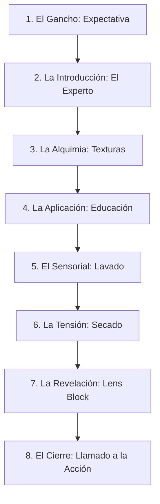

# 📱 ESTRATEGIA EDITORIAL PREMIUM: INSTAGRAM
## *Truss en Dos Soles — Historias, Feed y Carruseles*

Este plan editorial te muestra cómo organizar el material que vas a grabar el lunes para crear una narrativa magnética en **Historias** y, posteriormente, cómo reutilizar tus fotos y videos (B-Rolls) para inundar el **Feed** y los **Carruseles** de Dos Soles con contenido de altísima conversión.

---

## 🗺️ PARTE 1: El Flujo Narrativo Secuencial de Historias (Storytelling del Lunes)

Las historias de Instagram se consumen rápido. Si solo subes fotos fijas, la gente pasará de largo. Debes crear una "mini-película" que enganche, eduque y venda. Sigue esta secuencia exacta:

### 🎬 Secuencia Detallada de Historias:

#### 1. Historia 1: La Expectativa / El Gancho (09:00 hs)
* **Video**: Toma 1 (La Entrada Dinámica). Entrando al centro técnico Dos Soles.
* **Música**: Un beat moderno, de ritmo medio (ej. Lo-Fi animado o Tech House sutil).
* **Texto en pantalla**: *"¡Buen día! Hoy nos vinimos al Centro Técnico de Dos Soles porque se viene algo increíble con TRUSS... 💆‍♀️✨"*
* **Objetivo**: Generar curiosidad. Que el usuario no pase a la siguiente cuenta.

#### 2. Historia 2: El Protagonista y la Marca (09:15 hs)
* **Video**: Toma 2 (El Peluquero Estrella) + Toma 3 (Altar de Truss). El peluquero ordenando los productos Truss y saludando.
* **Audio (DJI Mic)**: El peluquero diciendo: *"Hola chicos, hoy vamos a estar haciendo una demostración de coloración técnica y reconstrucción con Truss. ¡Miren estos productos!"*
* **Texto en pantalla**: *"Hoy nos acompaña [Nombre del Estilista] para mostrarnos la magia de la coloración inteligente de Truss."*

#### 3. Historia 3: La Alquimia / Preparación (10:00 hs)
* **Video**: Toma 5 (La Alquimia - Mezcla de color en cámara lenta). Primer plano súper cerrado de la crema batida en el bowl.
* **Transición**: Termina esta historia con un **Whip Pan (Látigo Rápido)** hacia la derecha.
* **Texto en pantalla**: *"Preparando la fórmula perfecta de Truss. Miren esta textura cremosa... 🧪🎨"*

#### 4. Historia 4: La Aplicación / Educación (10:30 hs)
* **Video**: Toma 6 (Aplicación Técnica). Inicia con el final del Whip Pan. Muestra las manos del peluquero aplicando el color.
* **Audio (DJI Mic)**: El peluquero dando un tip rápido en 10 segundos: *"El secreto de Truss es aplicar el producto de manera uniforme en mechones finos para que la cutícula absorba toda la reconstrucción activa."*
* **Texto en pantalla**: *"Tip de experto: Aplicación uniforme en secciones finas."*

#### 5. Historia 5: El Momento Sensorial (11:30 hs)
* **Video**: Toma 7 (El Lavado Cenital en cámara lenta) + Toma 8 (Masaje Capilar). El agua corriendo por el cabello con espuma de champú Truss.
* **Estilo**: Silencia el audio original del salón y pon una música súper relajante y suave.
* **Texto en pantalla**: *"Momento de hidratación profunda y relax en el lavacabezas. ¿Sentís el aroma desde ahí? 💆‍♀️💦"*

#### 6. Historia 6: La Tensión antes del Resultado (12:45 hs)
* **Video**: Toma 9 (Viento en Cámara Lenta). El cabello volando con el secador, revelando destellos de luz.
* **Texto en pantalla**: *"El secado final... la luz del salón ya nos muestra un adelanto de lo que se viene. ¿Están listos para el cambio?"*
* **Interactividad**: Agrega un sticker de encuesta de Instagram: *"¿Lacio o con Ondas?"* o *"¿Quieren ver el resultado?"*.

#### 7. Historia 7: ¡LA REVELACIÓN MÁGICA! (13:15 hs)
* **Video**: Toma de la Transición 2 (Lens Block). El peluquero retira la botella de Truss pegada a la cámara y revela a la modelo sonriente con el **Brillo Espejo Truss** impecable.
* **Música**: El beat de la música "explota" o sube de volumen justo cuando se retira el frasco.
* **Texto en pantalla**: *"¡BOMBA! Reconstrucción y coloración con Brillo Espejo Truss. Miren la soltura de este cabello... 😍💎"*

#### 8. Historia 8: Cierre y Llamado a la Acción (13:45 hs)
* **Video**: Toma 10 (Testimonio Final). El estilista y la modelo sonrientes sosteniendo la línea Truss.
* **Audio (DJI Mic)**: El peluquero diciendo: *"Chicos, trabajar con Truss en el centro técnico de Dos Soles es otro nivel. Si quieren conseguir estos productos o capacitarse con nosotros, dejen un mensaje directo aquí abajo."*
* **Interactividad**: Agrega un sticker de enlace que lleve a su WhatsApp o un texto que diga: *"Escribí 'QUIERO TRUSS' y te mandamos el catálogo por privado"*.

---

## 🎞️ PARTE 2: Estrategia de Feed (Reels de Alto Impacto)

El lunes vas a grabar muchísimo material de B-Roll (tomas de apoyo). No lo dejes guardado en tu galería. Con esos mismos videos cortos vas a armar **3 Reels para el Feed** durante la semana:

### ⚡ Reel 1: El "Antes y Después" de Impacto Rápido
* **Estructura**:
  * **0-2 segundos**: La modelo con el cabello seco/dañado antes del tratamiento (con cara triste o seria) sosteniendo el producto Truss frente al lente.
  * **2-3 segundos**: Transición **Lens Block** (La botella tapa la cámara y se retira rápidamente).
  * **3-10 segundos**: Un montaje rápido de 4 o 5 tomas de la modelo feliz presumiendo su cabello brillante, moviéndolo en cámara lenta (60fps) bajo la luz del salón técnico.
* **Música**: Audio viral en tendencia de Instagram (beats enérgicos de electrónica o pop).
* **Copy (Texto del post)**: *"¿Creías que un cabello brillante y sin frizz en un solo día era imposible? Desliza para ver la magia de TRUSS Professional en nuestro Centro Técnico. 🌟 Escríbenos por privado para conseguir la línea en tu salón."*

### 🎓 Reel 2: Mini-Clase Técnica B2B (Tip de Experto para Estilistas)
* **Concepto**: Un formato altamente educativo que atrae a dueños de salones y estilistas profesionales porque resuelve un dolor de cabeza técnico real, posicionando a Dos Soles como líder en capacitación y Truss como la herramienta indispensable.
* **Estructura**:
  * **0-3 segundos (El Gancho)**: Gancho B2B con un problema del salón (ej. *"¿Cómo decolorar un cabello sensibilizado sin romper la fibra?"* o *"¿Falta de brillo tras teñir? Evitalo así..."*).
  * **3-15 segundos (El Desarrollo)**: Plano cerrado del peluquero aplicando la ampolla o mezcla Truss y explicando su química protectora en el Centro Técnico (audio DJI Mic ultra nítido).
  * **15-20 segundos (El Cierre)**: Llamado a la acción: *"Comentá CURSO para recibir la info de nuestro próximo taller técnico en Dos Soles"*.
* **Audio**: La voz en off del estilista grabada con el DJI Mic (ultra limpia, libre de ruidos de secadores), combinada con una música de fondo corporativa y moderna de bajo volumen.
* **Copy (Texto del post)**: *"¿Tus clientes se quejan de la pérdida de brillo después de una coloración? El secreto técnico de los grandes salones es proteger los enlaces químicos del cabello durante el proceso. En esta mini-clase técnica con TRUSS Professional te mostramos cómo lograr un Brillo Espejo impecable sin comprometer la fibra capilar. 🧪💇‍♂️ Déjanos un comentario con la palabra 'CURSO' y te enviamos toda la información de nuestras próximas capacitaciones exclusivas para profesionales en Dos Soles."*

---

## 📸 PARTE 3: Estrategia de Carruseles (Deslizar para Aprender)

Los carruseles son publicaciones con varias imágenes que el usuario desliza hacia los lados. **Son el formato que más guarda la gente en Instagram**, lo cual le encanta al algoritmo. Vas a usar las mejores fotos que tomes el lunes para armar estos 2 carruseles educativos:

### 📖 Carrusel 1: "El Paso a Paso del Brillo Espejo"
* **Desglose de Diapositivas (Slides)**:
  * **Slide 1 (Portada)**: Foto de la modelo con el cabello súper brillante y lacio desde atrás.
    * *Texto de portada*: *"El secreto del 'Brillo Espejo' en 4 pasos sencillos (con productos TRUSS)"*.
  * **Slide 2**: Foto del peluquero analizando el cabello de la modelo o mezclando el producto.
    * *Texto*: *"Paso 1: Diagnóstico y preparación con la dosis justa de nutrición activa"*.
  * **Slide 3**: Foto detallada de la aplicación del producto en los mechones finos.
    * *Texto*: *"Paso 2: Aplicación homogénea. La cutícula capilar se satura con los activos de Truss para reconstruir la fibra desde adentro"*.
  * **Slide 4**: Foto estética en el lavacabezas con el agua purificando el pelo.
    * *Texto*: *"Paso 3: Lavado sensorial con agua tibia para sellar los nutrientes sin resecar"*.
  * **Slide 5**: Foto de la modelo sonriente con el resultado final.
    * *Texto*: *"Paso 4: Sellado térmico con secador para activar el brillo espejo final"*.
  * **Slide 6 (Llamado a la acción)**: Imagen limpia con el logo de Dos Soles.
    * *Texto*: *"¿Quieres que tu salón ofrezca esta experiencia premium? Desliza para escribirnos o déjanos un comentario para recibir asesoría personalizada."*

### 💡 Carrusel 2: "3 Errores de Coloración que tu Peluquero Evita" (Educativo)
* **Desglose de Diapositivas**:
  * **Slide 1 (Portada)**: Foto en primer plano del peluquero experto batiendo el color Truss.
    * *Texto*: *"3 Errores de coloración que los expertos en nuestro Centro Técnico evitan al 100%"*.
  * **Slide 2**: Foto de la mezcla del color en primer plano.
    * *Texto*: *"Error 1: Saturar el cabello con oxidante genérico. Usamos Truss para proteger los enlaces de queratina durante el proceso técnico"*.
  * **Slide 3**: Foto del peluquero separando mechones.
    * *Texto*: *"Error 2: No respetar los tiempos de pose. Cada minuto cuenta para fijar el pigmento sin maltratar la fibra capilar"*.
  * **Slide 4**: Foto detallada de la aplicación de la ampolla reconstructora Truss.
    * *Texto*: *"Error 3: No hidratar post-coloración. Siempre aplicamos la reconstrucción Truss para cerrar la cutícula y fijar el brillo"*.
  * **Slide 5**: Foto del antes y después lado a lado de la modelo.
    * *Texto*: *"El resultado de evitar estos errores: un color vibrante, saludable y duradero."*
  * **Slide 6**: *"Síguenos en @dossoles.distribuidora para enterarte de nuestras próximas capacitaciones técnicas y masterclasses exclusivas."*

---

## 🎯 Resumen de tu Plan de Ataque para el Lunes:

* Grabas **TODO en 1080p a 60 FPS** (el formato rey de la edición).
* Haces **historias en vivo** siguiendo la Parte 1 para mantener a la gente enganchada hora tras hora.
* Guardas todos los fragmentos cortitos (B-Rolls) y sonidos nítidos del DJI Mic.
* Durante la semana, editas la **Mini-Clase B2B** y el **Antes/Después Reel** en CapCut a 60 FPS.
* Diseñas los **Carruseles** con las fotos más nítidas que saques.

¡Con esta estrategia no vas a hacer una simple historia aburrida, vas a montar una verdadera campaña de marketing profesional para Dos Soles! 🚀✨
